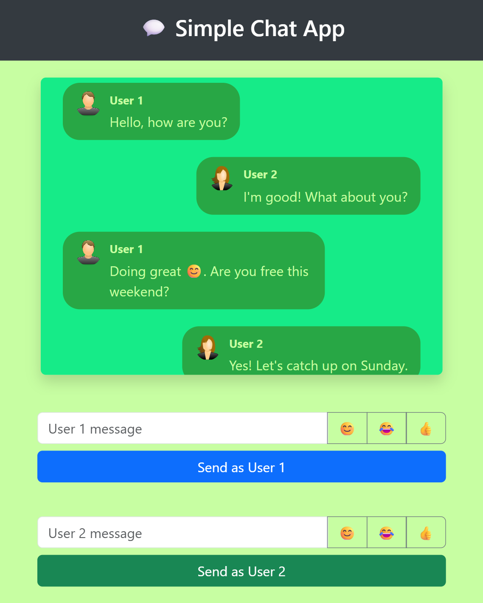

# 💬 Simple Chat App

A simple and responsive web-based chat application that allows two users (User 1 and User 2) to simulate a conversation on the same screen. Built using HTML, CSS with Bootstrap, and JavaScript.

---

## 🚀 Features

- Send and display messages from two different users.
- Includes emoji buttons to enhance chat interaction.
- Responsive design using Bootstrap grid layout.
- Displays user profile images and usernames with each message.
- Vertical divider between both user sections.
- Auto-scroll to the latest message.

---

## 🛠️ Technologies Used

- HTML5
- CSS3
- Bootstrap 5
- JavaScript (Vanilla JS)
- [emoji-button](https://github.com/joeattardi/emoji-button) library

---

## 📸 UI Preview



---

## 🔧 Setup Instructions

1. Clone the repository:
   ```
   git clone https://github.com/Amritasri10/simple-chat-app.git 

   cd simple-chat-app 
   ```

2. Open the app in a browser:

    - Just double-click the ```index.html``` file.
    - Or serve with a local web server like Live Server in VS Code.

3. Enjoy chatting.

---

## 📁 Project Structure

```
Simple-chat-app/
├── index.html      # Main HTML file
├── style.css       # Custom CSS styles
├── script.js       # Main JavaScript file
├── user1.png       # Image representing User 1
├── user2.png       # Image representing User 2
└── README.md       # Project description file 
```
---

## 💡 Future Enhancements

- Integrate Socket.IO or WebSocket API to enable real-time, multi-user communication over the network.

- Add login and registration features so users can have personalized chat sessions.

- Display time and date for each message to improve clarity and conversation flow.

- Store chat messages in local storage or a database (e.g., Firebase, MongoDB) so users can view past conversations.

- Add alert sounds when a new message arrives from the other user.

- Allow users to toggle between light mode and dark mode.

- Enable sending and previewing of images, documents, or other media files in chat.

- Add a modern emoji picker pop-up UI instead of static buttons.

---

## 📄 License

This project is open-source and available under the MIT License.
